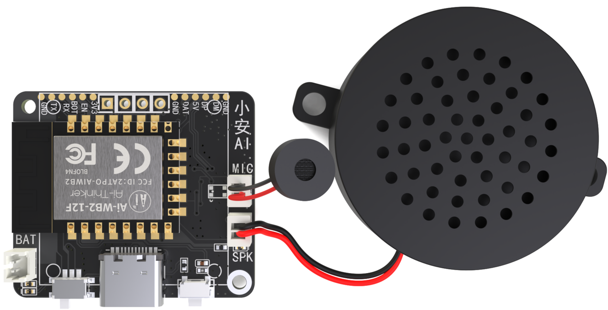
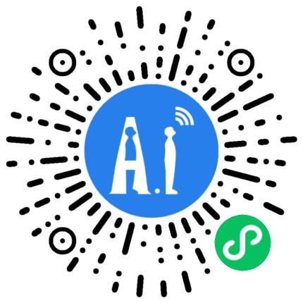
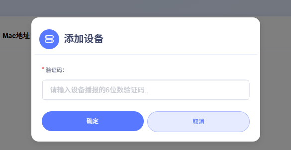

<h1 align="center">AiPi-PalChatV1:AI智能助手</h1>

<i>喜欢这个项目吗？请考虑给 Star ⭐️ 以帮助改进！</i>

## 相关视频

- **介绍视频:** [拥有一个AI语音实时翻译机是什么体验？？【Ai语音交互应用】_bilibili](https://www.bilibili.com/video/BV1SuEtzREV9?spm_id_from=333.788.videopod.sections&vd_source=02a465997504a99b4366d967ab71e479)
- **Video**: [AI Translator Assistant | AiPi PalChat V1 -TouTube](https://www.youtube.com/watch?v=AHNUB3JPgbw)

## 产品概述

AiPi-PalChatV1 是一款接入了 小智 AI 智能体 的微型语音交互开发板，专为轻量级智能语音场景设计。基于安信可 Ai-WB2-12F 模组主控，具备高集成度、高性价比等特性，支持 离线语音唤醒 与 语音打断 功能，结合 2W/8Ω 扬声器与双供电模式（Type-C + 电池），适用于快速部署语音交互能力的硬件创新场景。

## 核心功能亮点

- 离线语音交互
  - 支持离线语音唤醒，解放双手
  - 支持语音打断，提升交互自然度。
- 灵活供电模式
  - Type-C 有线供电，适配常规电源环境。
  - 电池供电设计，满足移动场景需求。
- 轻量级硬件配置
  - 小尺寸板载设计，易于集成到各类设备中。
  - 2W/8Ω 扬声器提供清晰音效输出。
- 便捷开发与配置
  - 微信小程序一键配网，简化设备联网流程。
  - 智能体配置可视化，支持自定义音色与场景逻辑。

## 可选AI模型

  

  

    
  

  

    
  

  

    
  

## 使用说明
## 1. 上电开机及充电

### 1.1 接线上电
必需分别插好麦克风、喇叭，可选择插入屏幕。
使用 Type-C 数据线接入设备的 Type-C 口，把"电源开关"拨到左边，红灯亮即开机。并播报欢迎语：
  - 网络未配置：
    - 播报：`“我是你的人工智能语音助手，请对我说，你好小安，开始配网”`
  - 网络已配置：
    - 播报：`”我是你的人工智能语音助手，请对我说，你好小安，唤醒我“`
### 1.2 电池充电
如已插入电池，在 Type-C 数据线接入后，充电指示灯亮起（蓝灯）即为正在充电，熄灭即为充满，如充电指示灯闪烁，即为未插入电池。

## 2. 配置网络和重新配网

### 2.1 配置网络

  <!-- 左侧步骤列表 -->
  

    <ol style="padding-left: 20px; line-height: 1.8;">
      <li>对设备说："你好小安"</li>
      <li>等待回复："我在"</li>
      <li>对设备说："开始配网"</li>
      <li>设备回复："进入配网模式，请使用安信可小程序或App 进行配网"</li>
      <li>微信扫描右边二维码，打开 "安信可 IOT 微信小程序"</li>
      <li>选择 "AI 硬件智能体"</li>
      <li>点击 "添加设备"</li>
      <li>点击 "扫描设备"</li>
      <li>找到 "BL602_XZ_V1.0_XXXXXXXXXX"，并连接
        <ul>
          <li>在 "SSID" 一栏填写 WiFi 名称（注意：WiFi 名称不带 5G 后缀）</li>
          <li>在 "密码" 一栏填写 WiFi 密码</li>
        </ul>
      </li>
      <li>填写完成之后，点击下方的 "配置WiFi"
        <ul>
          <li>设备回复："连网中"</li>
          <li>等待设备回复："连网成功" 即可</li>
          <li>如长时间没响应或提示 "连网失败"，请重复以上步骤</li>
        </ul>
      </li>
      <li>配网成功之后，请回到 "Ai 硬件智能体" 页面，进行设备管理</li>
    </ol>
  

  
  <!-- 右侧二维码图片 -->
  

    
  

### 2.2 重新配网
上电之后，使用语音指令：**`“你好小安，开始配网”`**，后根据“配置网络” 章节重新配置 WiFi。

## 3. 设备绑定与解绑
### 3.1 注册登录：[小智 AI 快捷入口](https://xiaozhi.me/)

在 安信可 IOT 小程序的`“Ai 硬件智能体”` 页面，选择设备型号为`”AiPi-PalChatV1“` 的设备，并进入设备的详情页，点击 复制网址 按钮，打开手机浏览器粘贴网址后，即可进入`"小智 AI"`配置页面。
1. 点击`”控制台“`
 	- 触发登录，输入相应的用户名和密码即可
 	- 如没有账号，请注册

### 3.2 设备验证码
首次使用时，联网成功之后，设备会循环播报验证码，务必记录下验证码，用于添加设备。

### 3.3 绑定设备
可以使用默认智能体`”台湾女友“`添加设备，步骤如下：
  - 点击添加设备
  - 输入播报的 `6 `位数字`”验证码“`
  - 绑定之后，务必手动复位设备

### 3.4 解绑设备

如存在设备，可`“智能体配置页面”`点击 设备进入设备管理页，滑到最右边的`“操作”`项，点击解绑 ，即可解绑设备。
### 3.5 配置智能体
点击 `配置角色`进行个性化配置，根据自己的喜好对智能体的`昵称`、`角色音色`、`语言偏好`、`语言模型`等进行配置。

## 4. 开始对话
### 4.1 重新上电
上电之后，等待`“联网成功“`提示之后，再唤醒设备。
### 4.2 语音唤醒
对设备说：`“你好小安”`，设备回复`“我在”`，即为唤醒。
### 4.3 连续对话
唤醒之后，即可和设备进行连续对话了。
