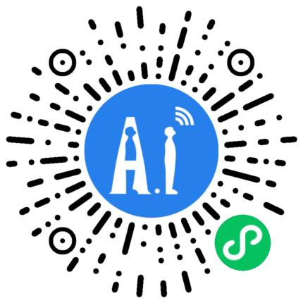
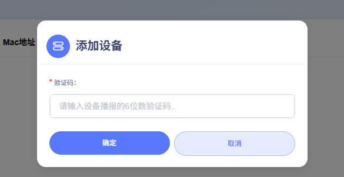

 

<h1 align="center">AiPi-PalChatV1:AI Intelligent Assistant</h1>

<i>Like the project?Please consider giving Star ⭐️ to help improve it!</i>

---

## Videos

- **Introductory video:** [拥有一个AI语音实时翻译机是什么体验？？【Ai语音交互应用】_bilibili](https://www.bilibili.com/video/BV1SuEtzREV9?spm_id_from=333.788.videopod.sections&vd_source=02a465997504a99b4366d967ab71e479)
- **Video**: [AI Translator Assistant | AiPi PalChat V1 -TouTube](https://www.youtube.com/watch?v=AHNUB3JPgbw)

## Product Overview

AiPi-PalChatV1 is a miniature voice interaction development board with access to the Xiaoshi AI intelligent body, designed for lightweight intelligent voice scenarios.It is based on Axiomtek's Ai-WB2-12F module master control, with high integration and cost-effective features, supporting offline voice wake-up and voice interruption, combined with 2W/8Ω speaker and dual power supply modes (Type-C + battery), which is suitable for hardware innovation scenarios with rapid deployment of voice interaction capabilities.

## Core Functionality Highlights

- Offline Voice Interaction
  - Support offline voice wake-up, free your hands
  - Support voice interruption to enhance the naturalness of interaction.
- Flexible power supply mode
  - Type-C wired power supply, suitable for conventional power environment.
  - Battery-powered design to meet the needs of mobile scenarios.
- Lightweight hardware configuration
  - Small size on-board design, easy to integrate into various devices.
  - 2W/8Ω speaker provides clear sound output.
- Convenient development and configuration
  - WeChat applet one-click network allocation, simplify the process of device networking.
  - Intelligent body configuration visualisation, support for custom tones and scene logic.

## Optional AI models

|  | |  |
| --- | --- | --- |

## Instructions for use
### 1. Power On and Charge

#### 1.1 Powering up
Plug in the microphone and speakers, and optionally the screen.
Use the Type-C cable to connect to the Type-C port of the device, turn the "Power Switch" to the left, and the red light will turn on the device.The red light will turn on the device and announce the welcome message:
  - The network is not configured:
	- Say：`“我是你的人工智能语音助手，请对我说，你好小安，开始配网”`
  - Network Configured：
	- Say：`”我是你的人工智能语音助手，请对我说，你好小安，唤醒我“`
#### 1.2 Battery Charging
If the battery has been inserted, after the Type-C cable is plugged in, the charging indicator lights up (blue) means it is charging, and goes off means it is full, if the charging indicator flashes, it means the battery is not inserted.

### 2. Configuring the network and rewiring the network

### 2.1 Configuring the Network

  <!-- 左侧步骤列表 -->
  

	<ol style="padding-left: 20px; line-height: 1.8;">
	  <li>Speak to the equipment："你好小安"</li>
	  <li>Waiting for a reply："我在"</li>
	  <li>Speak to the equipment："开始配网"</li>
	  <li>Device Response："进入配网模式，请使用安信可小程序或App 进行配网"</li>
	  <li>WeChat scan the QR code on the right and open "Ai-Thinker IOT WeChat App"</li>
	  <li>option "AI 硬件智能体"</li>
	  <li>strike "添加设备"</li>
	  <li>strike  "扫描设备"</li>
	  <li>locate "BL602_XZ_V1.0_XXXXXXXXXX"，并连接
		<ul>
		  <li>Fill in the WiFi name in the  "SSID" field (Note: WiFi name without 5G suffix)</li>
		  <li>Fill in the WiFi password in the  "Password" field</li>
		</ul>
	  </li>
	  <li>Once filled out, click"Configure WiFi"below
		<ul>
		  <li>Device response："连网中"</li>
		  <li>Waiting for device response："连网成功" </li>
		  <li>If there is no response for a long time or it prompts "连网失败"，please repeat the above steps</li>
		</ul>
	  </li>
	  <li>After successful distribution, please go back to the "Ai 硬件智能体" page for device management</li>
	</ol>
  

  
  <!-- 右侧二维码图片 -->
  

	
  

#### 2.2 Redistribution
After powering on the device, use the voice command: **`"Hello An, start network configuration"`** and reconfigure the WiFi according to the "Configuring the network" section.

### 3. Device Binding and Unbinding
#### 3.1 Register and Login: [Ai AI Shortcut Portal](https://xiaozhi.me/)

On the `Ai Hardware Intelligence Body`page of the Ensync IOT applet, select the device with the model number `AiPi-PalChatV1` and enter the device's detail page, click the Copy URL button, open your mobile phone's browser and paste the URL, then you can enter the `Smart AI''.After pasting the URL, you can enter the `"AiPi-PalChat AI"` configuration page.
1. Click ``Console'' to trigger login.
	- Trigger the login, enter the corresponding user name and password.
	- If you don't have an account, please register.

### 3.2 Device Authentication Code
When you use the device for the first time, the device will broadcast the verification code after successful networking, make sure to record the verification code for adding devices.

### 3.3 Device Binding
You can use the default smartphone `Taiwan Girlfriend` to add devices, the steps are as follows:
  - Click Add Device
  - Input the `6` digit `Verification Code`.
  - After binding, be sure to reset the device manually.

### 3.4 Unbinding the device

If the device exists, you can `SmartBody Configuration Page` click on the device to enter the device management page, slide to the rightmost `Options` item, and click Unbind to unbind the device.
### 3.5 Configuring an Intelligent Body
Click `Configure Role` for personalised configuration, and configure the `Nickname`, `Role Tone`, `Language Preference`, `Language Model`, etc. of the smart body according to your own preferences.

## 4. Starting a dialogue
## 4.1 Repowering
After powering up the device, wait for the `Networking Successful` prompt before waking up the device.
### 4.2 Wake up by voice
Wake up the device by saying `Hello Ani` and the device replies `I am here`.
### 4.3 Continuous dialogue
After waking up, you can have a continuous dialogue with the device.
*** Translated with www.DeepL.com/Translator (free version) ***

## 5. For detailed information, please go to：[AiPi-PalChatV1 Guidelines for use](https://fcniufr8ibx1.feishu.cn/docx/KMkcdhnSnoG0JIxwbx3cZGTZnyd?from=from_copylink)